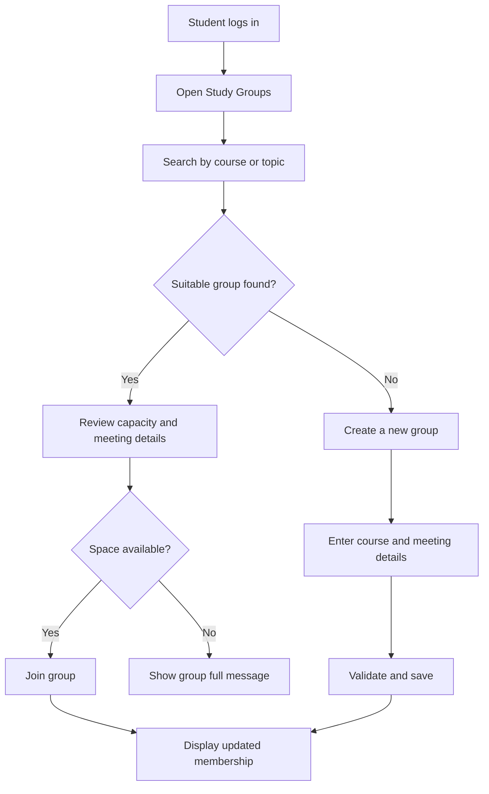

# Study-group activity

```mermaid
flowchart TD
    A[Student logs in] --> B[Open Study Groups]
    B --> C[Search by course or topic]
    C --> D{Suitable group found?}
    D -- Yes --> E[Review capacity and meeting details]
    E --> F{Space available?}
    F -- Yes --> G[Join group]
    F -- No --> H[Show group full message]
    D -- No --> I[Create a new group]
    I --> J[Enter course and meeting details]
    J --> K[Validate and save]
    G --> L[Display updated membership]
    K --> L
```
