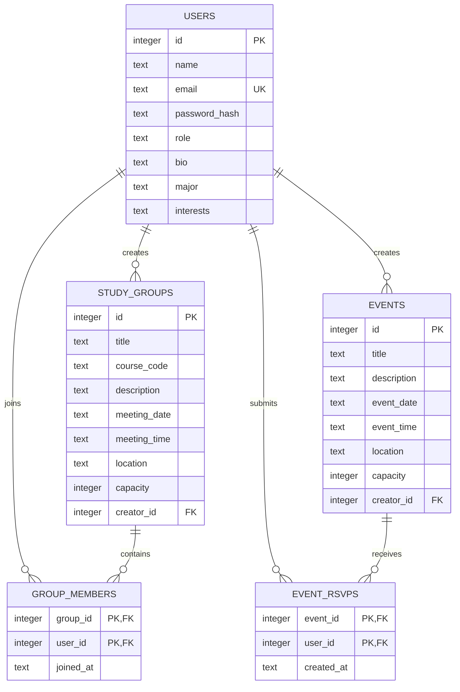

# Database schema

Primary owner: Shazib Bosu

```mermaid
erDiagram
    USERS ||--o{ STUDY_GROUPS : creates
    USERS ||--o{ GROUP_MEMBERS : joins
    STUDY_GROUPS ||--o{ GROUP_MEMBERS : contains
    USERS ||--o{ EVENTS : creates
    USERS ||--o{ EVENT_RSVPS : submits
    EVENTS ||--o{ EVENT_RSVPS : receives

    USERS {
      integer id PK
      text name
      text email UK
      text password_hash
      text role
      text bio
      text major
      text interests
    }
    STUDY_GROUPS {
      integer id PK
      text title
      text course_code
      text description
      text meeting_date
      text meeting_time
      text location
      integer capacity
      integer creator_id FK
    }
    GROUP_MEMBERS {
      integer group_id PK,FK
      integer user_id PK,FK
      text joined_at
    }
    EVENTS {
      integer id PK
      text title
      text description
      text event_date
      text event_time
      text location
      integer capacity
      integer creator_id FK
    }
    EVENT_RSVPS {
      integer event_id PK,FK
      integer user_id PK,FK
      text created_at
    }
```
