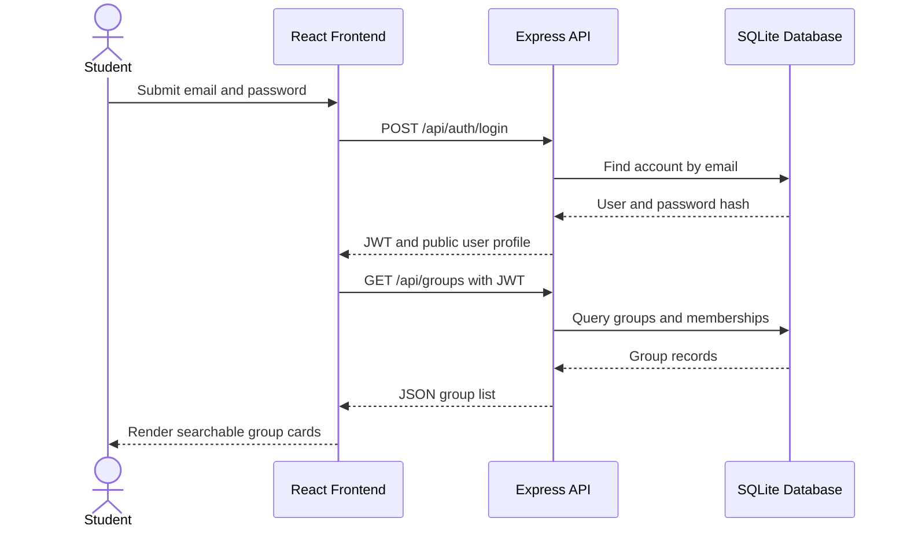

# Login and study-group sequence

```mermaid
sequenceDiagram
    actor Student
    participant React as React Frontend
    participant API as Express API
    participant DB as SQLite Database
    Student->>React: Submit email and password
    React->>API: POST /api/auth/login
    API->>DB: Find account by email
    DB-->>API: User and password hash
    API-->>React: JWT and public user profile
    React->>API: GET /api/groups with JWT
    API->>DB: Query groups and memberships
    DB-->>API: Group records
    API-->>React: JSON group list
    React-->>Student: Render searchable group cards
```
