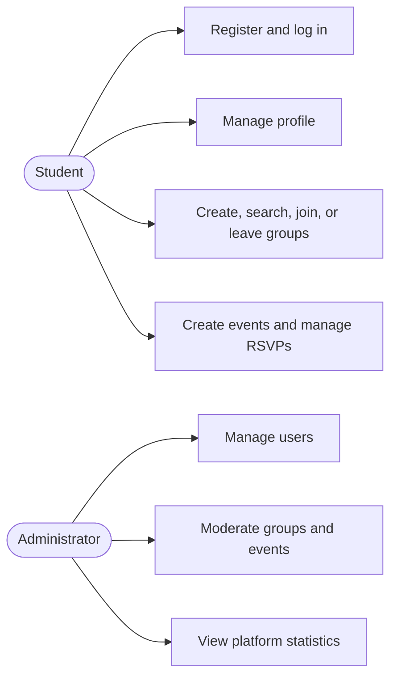

# Use-case model

```mermaid
flowchart LR
    Student([Student])
    Admin([Administrator])
    Student --> Register[Register and log in]
    Student --> Profile[Manage profile]
    Student --> Groups[Create, search, join, or leave groups]
    Student --> Events[Create events and manage RSVPs]
    Admin --> Users[Manage users]
    Admin --> Moderate[Moderate groups and events]
    Admin --> Stats[View platform statistics]
```
